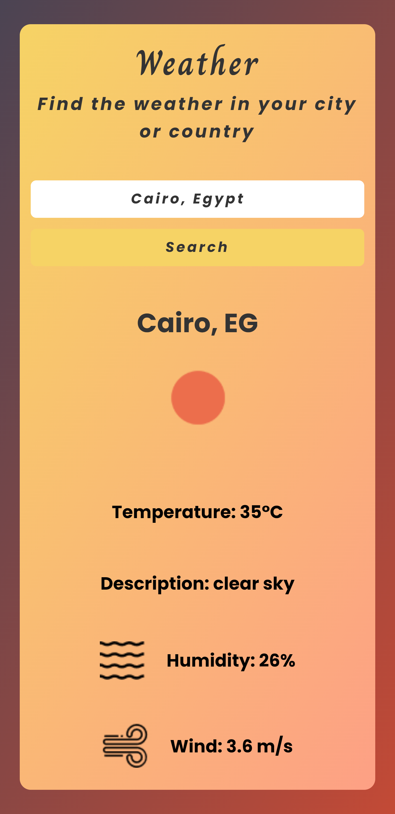
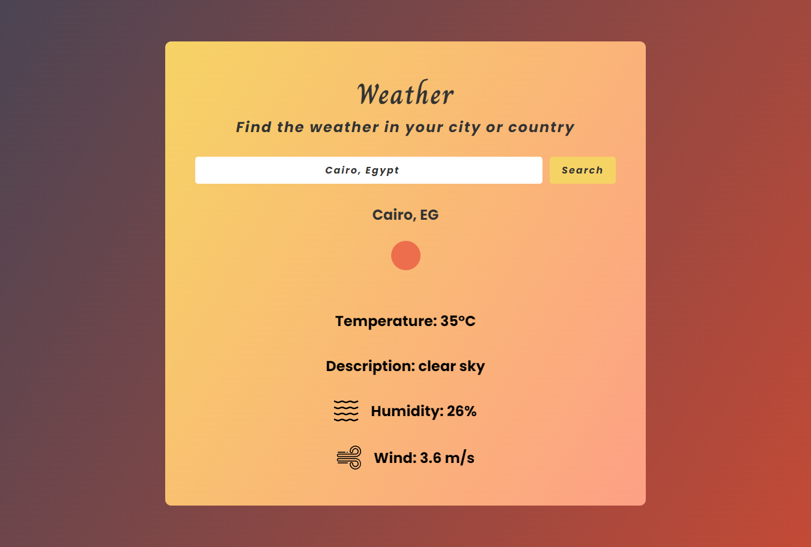

# Weather App

## Description

The Weather App is a sleek, user-friendly application that provides real-time weather updates for cities worldwide. Built with React, it leverages the OpenWeatherMap API to deliver accurate and current weather information, including temperature, humidity, wind speed, and weather conditions.

## Features

- **Real-Time Weather Data**: Get up-to-date weather information for any city.
- **Search Functionality**: Easily search for weather details by city name.
- **Autocomplete Suggestions**: Enhanced search with autocomplete for cities around the world.
- **Responsive Design**: Optimized for all screen sizes, providing a seamless experience on both desktop and mobile devices.
- **Animated Weather Icons**: Visual representation of current weather conditions with animations.

## Technologies Used

- **React**: JavaScript library for building user interfaces.
- **OpenWeatherMap API**: API for fetching real-time weather data.
- **CSS**: For styling and responsive design.
- **Animate.css**: For smooth animations.

## Installation

1. **Clone the repository**:
   ```bash
   git clone https://github.com/your-username/weather-app.git
   ```
2. **Navigate to the project directory**:
   ```bash
   cd weather-app
   ```
3. **Install dependencies**:
   ```bash
   npm install
   ```
4. **Add your OpenWeatherMap API key**:
   - Create a `.env` file in the root directory.
   - Add your API key to the `.env` file:
     ```env
     VITE_API_KEY=your_api_key
     ```

## Usage

1. **Start the application**:
   ```bash
   npm run dev
   ```
2. **Open your browser** and visit `http://localhost:3000` to use the app.

## Contributing

We welcome contributions to enhance the Weather App. Please fork the repository and submit a pull request with your improvements.

## License

This project is licensed under the MIT License.

---

**Enjoy using the Weather App! Stay updated with the latest weather conditions wherever you are.**




